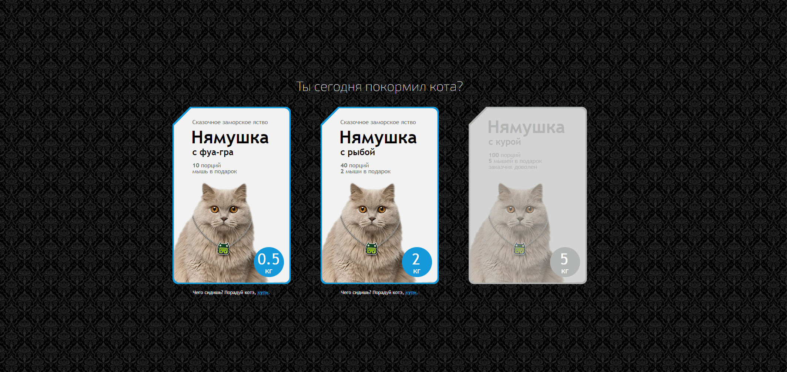

#### **Квалификационные задания для разработчиков HTML/CSS/JS by FUNBOX**

Task Requirements

- [x] Фон занимает всю площадь экрана, блок находится по центру вертикально и
горизонтально.
- [x] На планшетах упаковки располагаются треугольником, на смартфонах друг
под другом.
- [x] Информация о продукте может меняться.
- [x] Каждая из упаковок может быть выбрана или недоступна для выбора. Выбор
осуществляется нажатием на упаковку или на текст «купи» в описании.
- [x] Можно выбрать одновременно несколько упаковок, а также отменить свой
выбор повторным нажатием на упаковку.
- [x] Состояние наведения применяется к выбранной упаковке не сразу, а после
того, как курсор ушел с нее после первоначального выбора. 

